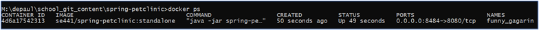
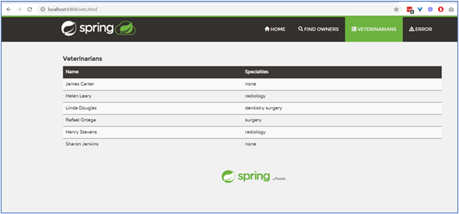
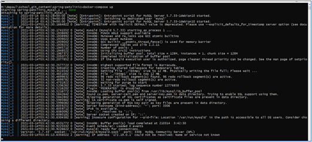
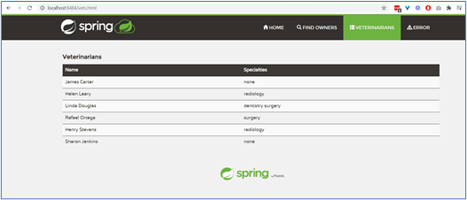
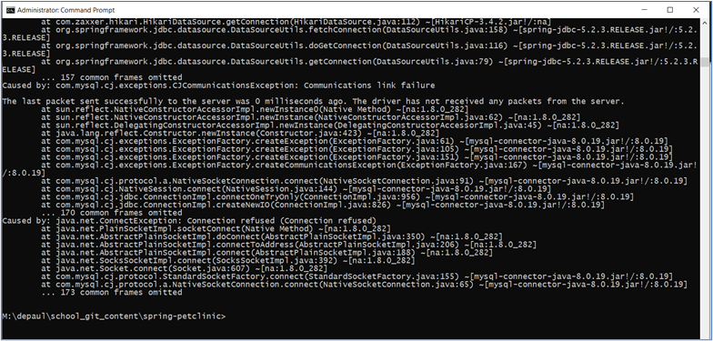
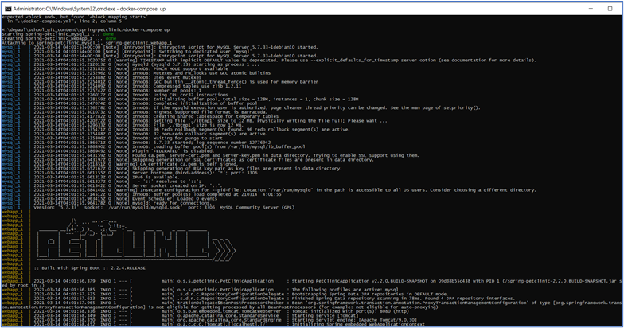
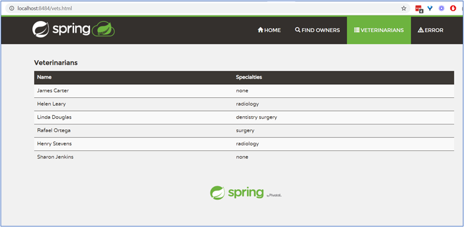

HW8 - Ravi

DOCKER 

5 pts Your dockerfile. Please provide a link to this file rather than a screen capture.
	
	https://github.com/rsharm18/spring-petclinic/blob/master/Dockerfile
	
5 pts Your running docker instance as shown by a ps command. 
	
	

5 pts Your browser accessing the main page of the website from your local container. 
	
	

DOCKER COMPOSE - MYSQL ONLY 

5 pts The output from the docker-compose up command. 
	
	

5 pts Your browser accessing the “Veterinarians” page of the website from your local container when you run the application from the host system. 

	

5 pts A section of the stack trace generated when you attempt to run the application container that has been updated to use MySQL. 

	

DOCKER COMPOSE - APP SERVER AND MYSQL 

5 pts Your updated docker-compose.yml file containing the application server, built from your local Dockerfile, and the existing MySQL configuration. Please provide a link to this file rather than a screen capture.
	
	https://github.com/rsharm18/spring-petclinic/blob/master/docker-compose.yml
	
5 pts Your updated application-mysql.properties file containing the URL change for the database server. Please provide a link to this file rather than a screen capture. 
	
	https://github.com/rsharm18/spring-petclinic/blob/master/src/main/resources/application-mysql.properties
	
5 pts The output from the docker-compose up command. 

	
	
5 pts Your browser accessing the “Veterinarians” page of the website from your local container.

	

================= END =======================

Hw6

1. (5 pts) Your Github account showing that is has been forked from the depaulcdm/springpetclinic repository.
	 
	
2. (5 pts) Your Travis CI dashboard showing a successful first build.
	 
	
3. (5 pts) The section of the POM file showing the coordinates after you’ve changed them.
	 
	
4. (5 pts) Your Travis CI dashboard showing a successful build after your change of the group ID.
	 

5. (5 pts) The section of the POM file showing the coordinates after you’ve commented them out.
	 

6. (5 pts) Your Travis CI dashboard showing the unsuccessful build after the breaking change.
	 

7. (5 pts) Your Github repository with the readme.md file selected showing the build failed status after the Travis CI build fails.
	 

8. (5 pts) The section of the POM file showing the coordinates after you’ve fixed them.
	 

9. (5 pts) Your Travis CI dashboard showing the successful build after the breaking change has been fixed.
	 

10. (5 pts) Your Github repository with the readme.md file selected showing the build success status after the Travis CI build has recovered.
	 
